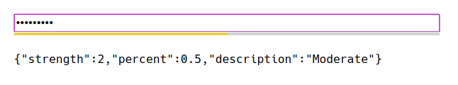

What?
-----

This is a demo application for the Haskell [zxcvbn-hs][] password
strength estimation package.  More information about zxcvbn and the
Haskell implementation can be found [at this repository][zxcvbn-hs].

How?
----

To play with this demo you need to:

  1. Either use the [Docker image][image] or build from source
  2. Start the service
  3. Go to <http://localhost:12345/>

### Using the Docker Image ###

If you have Docker installed, using the [Docker image][image] is super simple:

```
$ docker run -p 127.0.0.1:12345:12345/tcp sthenauth/zxcvbn-ws
```

That will download the image and start the web server.  Now just play
with it at <http://localhost:12345/>.

### Building from Source ###

If you have an existing Haskell toolchain installed then you can use
`cabal install`.  Otherwise keep reading.

  1. Install [Nix][] which is pretty simple and straight forward.

  2. Open a new terminal and run the following command in the
     directory containing this file:

         $ nix-build

  3. Wait for everything to build.

  4. Start the web server:

         $ zxcvbn_ws_datadir=$(pwd) ./result/bin/zxcvbn-ws

Configuration
-------------

You can change the port that `zxcvbn-ws` uses by setting the
`ZXCVBN_PORT` environment variable.

[zxcvbn-hs]: https://code.devalot.com/sthenauth/zxcvbn-hs
[image]: https://hub.docker.com/r/sthenauth/zxcvbn-ws
[nix]: https://nixos.org/nix/download.html
